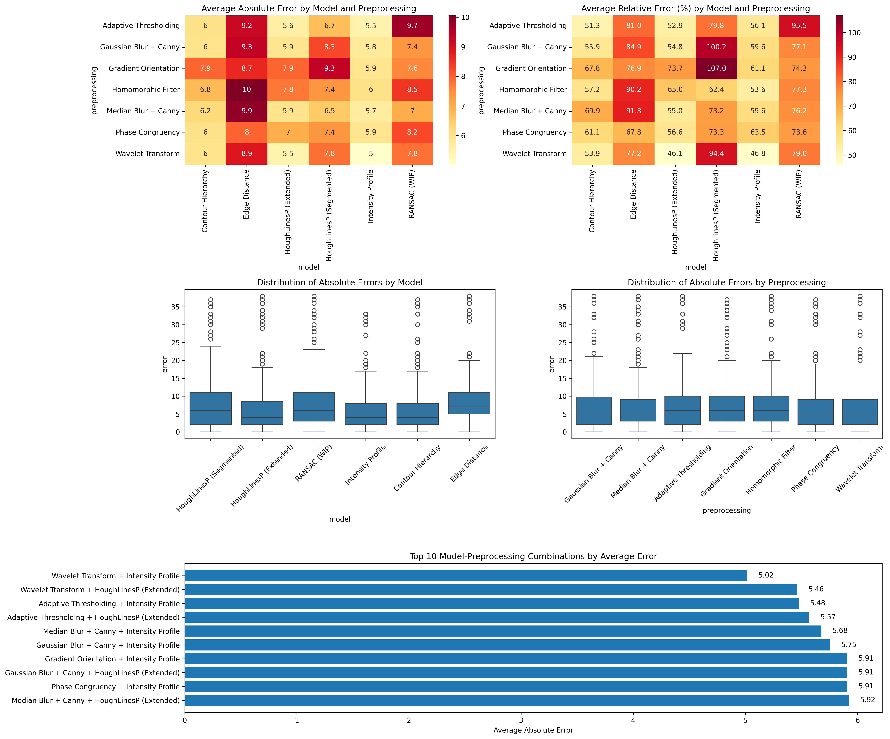
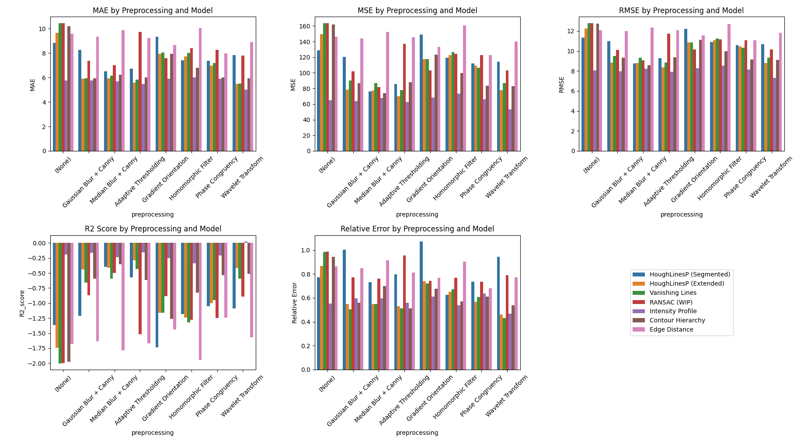
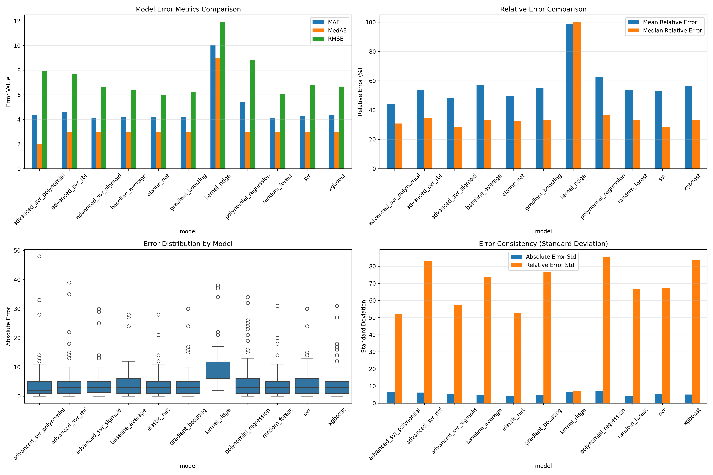
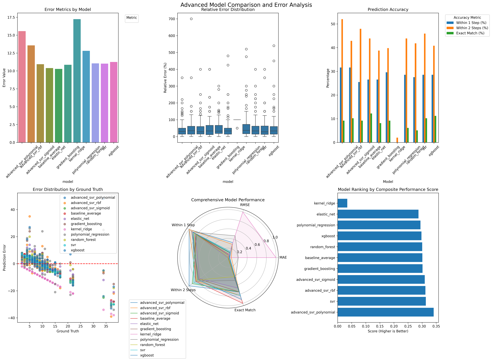

# Stairway-to-Data

__Detection et Comptage de Marches d'Escalier__

## Description
Ce projet a pour objectif de détecter et de compter automatiquement le nombre de marches d'un escalier à partir d'une image capturée par un téléphone. L'approche combine des méthodes de vision par ordinateur et des modèles d'apprentissage machine.

## Objectifs
- **Acquisition des images** : Base de données structurée avec annotations manuelles
- **Prétraitement avancé** : Filtrage adaptatif, ondelettes et techniques d'amélioration de contraste
- **Détection multi-méthodes** : Combinaison de contours, lignes et approches géométriques
- **Modèles ML** : Implémentation de Xgboost, Elastic Net, Random Forest et SVR
- **Évaluation rigoureuse** : Métriques de régression et analyse comparative
- **Interface utilisateur** : GUI interactive pour exploration des résultats

## Arborescence du projet (simplifiée)
```
.
├── data/                  # Données brutes et traitées
│   ├── raw/               # Images originales
│   ├── processed/         # Images prétraitées
│   ├── data_annotations.json # Vérité terrain
│ 
├── src/                   # Code source principal
│   ├── preprocessing/     # Techniques de prétraitement
│   ├── models/            # Algorithmes de détection
│   ├── evaluation/        # Métriques et évaluation
│   ├── gui/               # Interface graphique
│   └── utils.py           # Fonctions utilitaires
│
├── results/               # Résultats d'expérimentation
│   ├── algorithm/         # Résultats méthodes classiques
│   └── machine_learning/  # Performances des modèles ML
│
├── experiments/           Scripts d'expérimentation
├── tests/                 Tests unitaires
└── main.py                Point d'entrée principal
```

## Installation
```bash
git clone https://github.com/Kemoory/Stairway-to-heaven.git
cd Stairway-to-heaven
python3 -m venv env
source env/bin/activate
pip install -r requirements.txt
```

## Utilisation
Exécuter le pipeline complet avec interface graphique :
```bash
python main.py --gui
```

## Dépendances principales
- OpenCV 4.5+ (traitement d'image)
- Scikit-learn 1.0+ (modèles ML)
- PyWavelets (prétraitement)
- Matplotlib/Seaborn (visualisation)
- Joblib (optimisation)

## Évaluation des performances
Les performances sont évaluées à l'aide de métriques de régression adaptées au comptage d'images :

```python
from src.evaluation.utils import (
    calculate_mean_absolute_error,
    calculate_mean_squared_error,
    calculate_root_mean_squared_error,
    calculate_r2_score,
    calculate_relative_error
)
```

**Métriques clés :**
- MAE (Erreur Absolue Moyenne)
- MSE (Erreur Quadratique Moyenne)
- RMSE (Racine de l'Erreur Quadratique Moyenne)
- R² (Coefficient de Détermination)
- Erreur Relative Moyenne

**Stratégie d'évaluation :**
1. Validation croisée sur les données
2. Comparaison algorithmes vs modèles ML
3. Analyse des erreurs en identifiant les images problématique
4. Visualisation des prédictions problématiques

## Résultats
Les performances sont stockées dans :
```
results/
├── algorithm/
│   ├── evaluation_results.json
│   └── visualisations/
└── machine_learning/
    ├── model_comparison.png
    └── error_analysis.png
```

## Résultats Visuels

#### Algorithmes Classiques

Résultats globaux des algorithmes de détection :

**Comparaison des Modèles**

Figure 1 : Résumé global des performances des algorithmes classiques.



**Analyse des Erreurs**

Figure 2 : Calcul des erreurs selon différente méthode



#### Modèles de Machine Learning

Voici une comparaison des performances des différents modèles de machine learning :

**Comparaison des Modèles**

Figure 3 : Comparaison des performances des modèles (Xgboost, Gradient Boosting, Random Forest, SVR).




**Analyse des Erreurs**

Figure 4 : Analyse des erreurs pour les prédictions des modèles de machine learning.



## Licence
[En cours de définition - Contacter l'auteur pour utilisation]
